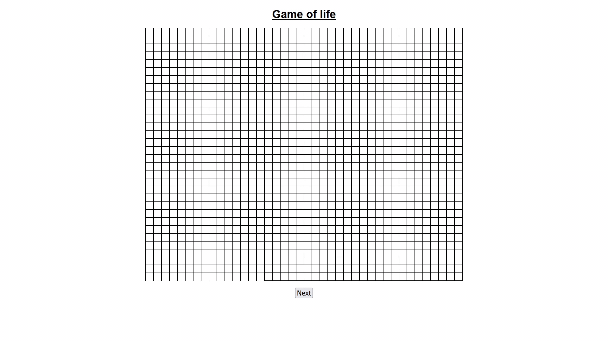

# Game of life

This is the famous no-player game [Conways game of life](https://en.wikipedia.org/wiki/Conway's_Game_of_Life), made in vanilla Javascript.

## What is this?
Conways game of life is a zero player game. This means that these so called cells follow certain rules to update every round.
Read about the rules [in this Wikipedia article](https://en.wikipedia.org/wiki/Conway%27s_Game_of_Life#Rules).

## How to play
First you have to go to [my site](https://life.johannespour.de) or host this on your own. <br>

You can toggle the state of the **cells** in the grid between alive(black) and dead(white). <br>

Just click **Next** to move on to the next generation.

## Host on your own
You access this on [my site](https://life.johannespour.de), but you can also host it on your own like this:
```sh
$ git clone https://github.com/Tch1b0/GameOfLife

$ cd ./GameOfLife/

$ docker-compose build

$ docker-compose up -d
```
Now the site is running on port `5004`.